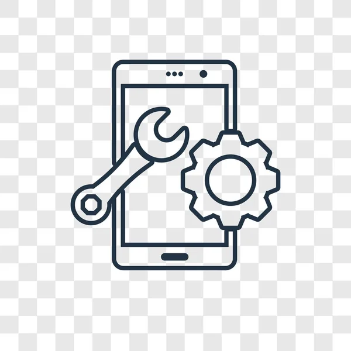

# 📱 Repositorio de PMDM

Este es el repositorio oficial de la asignatura **Programación Multimedia y Dispositivos Móviles (PMDM)**. Aquí encontrarás los proyectos, prácticas y recursos desarrollados durante el curso. El objetivo es aprender y aplicar los fundamentos del desarrollo de aplicaciones móviles utilizando las tecnologías más actuales.

---

---

## Contenido

- Ejercicios prácticos
- Proyectos de clase
- Recursos y documentación adicional

## Instalación

Clona este repositorio:
git clone https://github.com/dandragu99/PMDM.git
